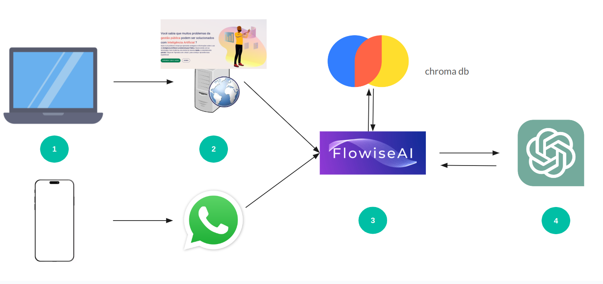

# Front end do chatbot assis
<br>
www.assischatbot.com.br

## Arquitetura geral



1. Nossos usuários podem acessar o assis por qualquer dispositivo, computador ou mobile.
O frontent é responsivo, então também pode ser acessado por mobile.
2. O Assis está disponível via URL na web ou pelo seu contato no whatsapp. Este repositório hospeda o código do front-end. Para a integração com o whatsapp é usado o evolution manager (https://github.com/EvolutionAPI/evolution-manager).
3. Tanto o front end quanto o gerenciador do whatsapp encaminham as mensagens para o Flowise. O Flowise realiza a gestão de chat e busca no chromadb por conteúdos similares aos que o usuário forneceu em sua mensagem.
4. Contendo os top 5 conhecimentos recuperados e a memória da conversa, o Flowise encaminha a mensagem para o ChatGPT, que gera a resposta.

# Operação

### Pré-requisitos:
* Node: frontend
* docker: demais

## Front end

## Project setup
```console
npm install
```

### Compiles and hot-reloads for development
```console
npm run dev
```

### Compiles and minifies for production
```console
npm run build
```

## Evolution Manager

Executar o comando docker run para o docker baixar a api do repositório e executar:
```console
docker run -d --name evolution_api -p 8080:8080 -e AUTHENTICATION_API_KEY=[CHAVE AQUI] atendai/evolution-api:latest
```

## Flowise (backend)

Clonar o repositório e executar o docker-compose
```console
cd Flowise/docker && docker-compose up
```